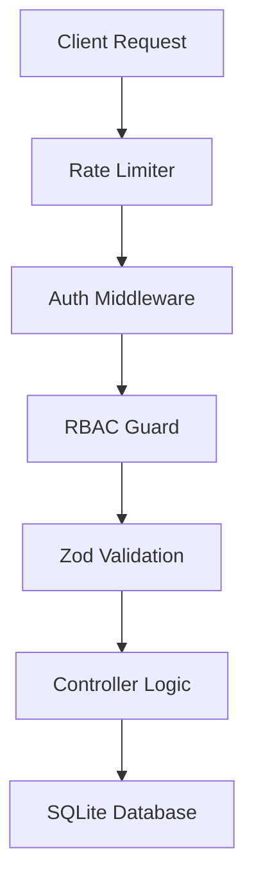

# Internal Technical Documentation 📚🏛️

This document explains the "How and Why" behind your finance backend architecture. It's built as a **layered system** for security and scalability.

---

## 🏛️ System Architecture Overview

The project follows a **Modified Controller-Service-Route** pattern.



### **1. Entry Point (`src/index.js`)**
-   **Security First**: The global `globalLimiter` and `authLimiter` are the very first things a request hits to prevent DDoS/Brute-force.
-   **Centralized Error Handling**: Any crash in any file is caught by the error-handling middleware at the bottom, returning a clean JSON response instead of a HTML crash page.

### **2. Security Layer (`src/middleware/`)**
-   **Authentication (`auth.js`)**: Decodes the JWT from the `Authorization` header and attaches the `user` object to the request (`req.user`).
-   **RBAC (`rbac.js`)**: A higher-order function `authorize(['ADMIN', 'ANALYST'])` that checks if the `req.user.role` is allowed to proceed.

### **3. Data Integrity (`src/utils/validation.js`)**
-   **Zod Schemas**: Every input (Login, Registration, Transactions) is strictly typed. If a user sends a string where a number is expected, Zod catches it before the database even knows about it.

---

## 🔍 How Features Work 'Under the Hood'

### **Pagination & Keyword Search** 📑
In [`src/controllers/transactionController.js`](file:///c:/Users/hassa/Desktop/Zorvyn%20Backend%20Project/src/controllers/transactionController.js):
- **Pagination**: We use `LIMIT` and `OFFSET` in SQL. `limit` controls how many rows we get; `offset` skips the ones from previous pages.
- **Search**: We use the SQL `LIKE %search%` operator. It searches the `description` and `category` fields simultaneously.

### **Soft Delete Implementation** 🗑️
Instead of `DELETE FROM transactions` (which is permanent), we use:
```sql
UPDATE transactions SET isDeleted = 1, deletedAt = ? WHERE id = ?
```
- **Where is it?**: This is handled in `transactionController.js` for the `DELETE` endpoint.
- **Impact**: All other endpoints (List, Summary, Trends) have been updated with `WHERE isDeleted = 0` to ignore these "hidden" records.

### **Auto-Migration System** 🛡️
Found in [`src/db/database.js`](file:///c:/Users/hassa/Desktop/Zorvyn%20Backend%20Project/src/db/database.js):
- To prevent database errors when columns are missing, we run `ALTER TABLE ... ADD COLUMN ...` every time the server starts. We use `IF NOT EXISTS` logic to skip it if it's already done.

---

## 📂 Developer Directory Map

| Folder | What's Inside? | Purpose |
| :--- | :--- | :--- |
| `src/routes` | Route definitions | Mapping URLs to the correct controllers. |
| `src/controllers`| Pure Logic | Where the database queries and calculations live. |
| `src/middleware` | Gatekeepers | Security and role checking. |
| `src/db` | Database Engine | Initialization, Schema, and Seeding logic. |
| `src/utils` | Tools | Reusable Zod schemas. |
| `tests` | Quality Assurance | Integration tests using Jest. |

---

## 📜 Technology Selection (Why these?)

1.  **JSON Web Tokens (JWT)**: Chosen for stateless security. It allows the server to verify a user without needing a "session" stored in the database.
2.  **SQLite**: Exceptional for portability. The database is a single file (`finance.db`) that travels with your code.
3.  **bcryptjs**: The industry standard for one-way password hashing.
4.  **express-rate-limit**: A lightweight, effective way to manage traffic and block malicious actors.
